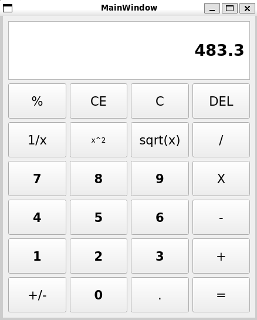

# Qt Calculator

A simple calculator application built with **Qt** and **C++11**. It supports basic arithmetic operations, percent and sign toggling, input validation, and both **mouse click** and **keyboard** interaction.

## Features

* Basic operations: addition, subtraction, multiplication, division
* Percent conversion (`%` key or button)
* Toggle sign (±)
* Decimal point support
* Input deletion (backspace) and full clear (delete)
* Keyboard shortcuts for all operations
* Error handling for division by zero

## Screenshots



## Build Instructions

### Requirements

* Qt 5 or Qt 6 (Widgets module)
* CMake 3.5+
* C++11 compiler

### Build Steps

```bash
git clone https://github.com/yourname/qt-calculator.git
cd qt-calculator
mkdir build && cd build
cmake ..
make
./calc
```

> On Windows, open the CMake-generated project in Qt Creator and run it from there.

## Keyboard Support

| Key           | Function              |
| ------------- | --------------------- |
| 0-9           | Digit input           |
| `+ - * /`     | Operators             |
| `.`           | Decimal separator     |
| `Enter` / `=` | Calculate result      |
| `Backspace`   | Delete last digit     |
| `Delete`      | Clear all input       |
| `%`           | Percentage conversion |

## Project Structure

* `mainwindow.cpp/.h/.ui` – Main GUI and logic
* `calchandler.cpp/.h` – (Optional) Calculation logic abstraction
* `main.cpp` – Application entry point
* `CMakeLists.txt` – Build configuration

## License

This project is licensed under the MIT License.

