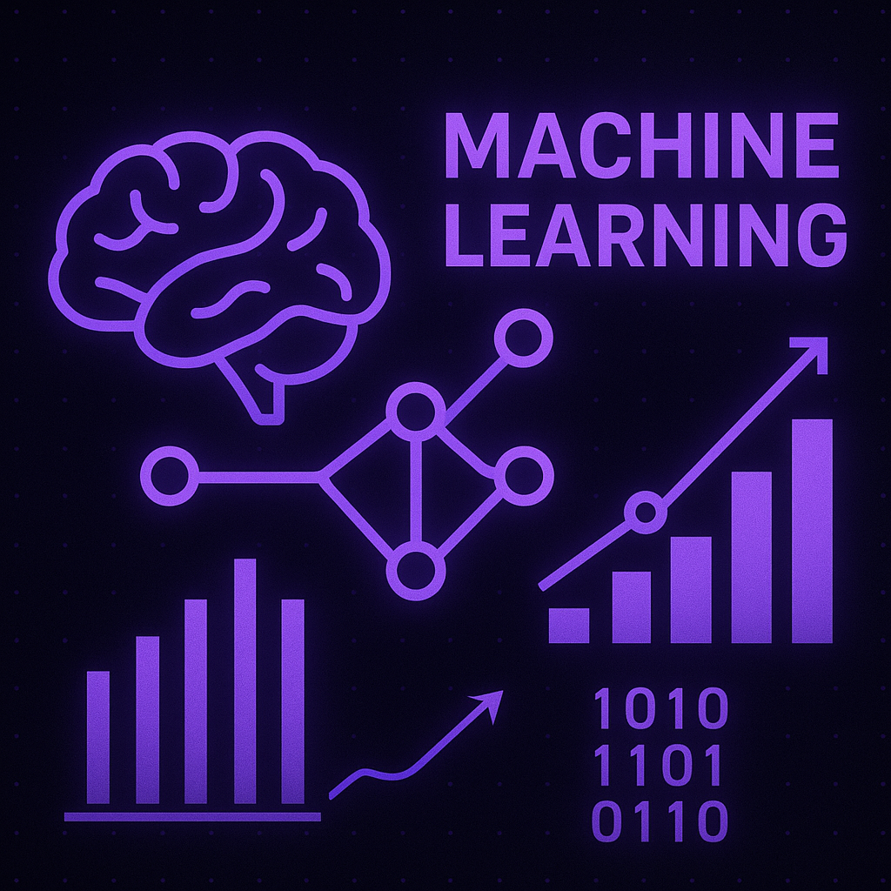

# My Machine Learning Zoomcamp Journey

### Описание
Это документация моего опыта прохождения [Machine Learning Zoomcamp](https://github.com/DataTalksClub/machine-learning-zoomcamp), предлагаемого DataTalks.Club. Он содержит все мои домашние задания, заметки и проекты, выполненные в течение курса. Цель этого проекта — продемонстрировать мои работы, отслеживать прогресс и служить портфолио моих навыков в области машинного обучения.

### Модули курса и домашние задания

Этот раздел содержит ссылки на папки для каждого модуля курса. Каждая папка содержит выполненные мной домашние задания, а также соответствующий код или заметки.

- **Module 1:** [Introduction to Machine Learning](./01-introduction/)
- **Module 2:** [Machine Learning for Regression](./02-regression/)
