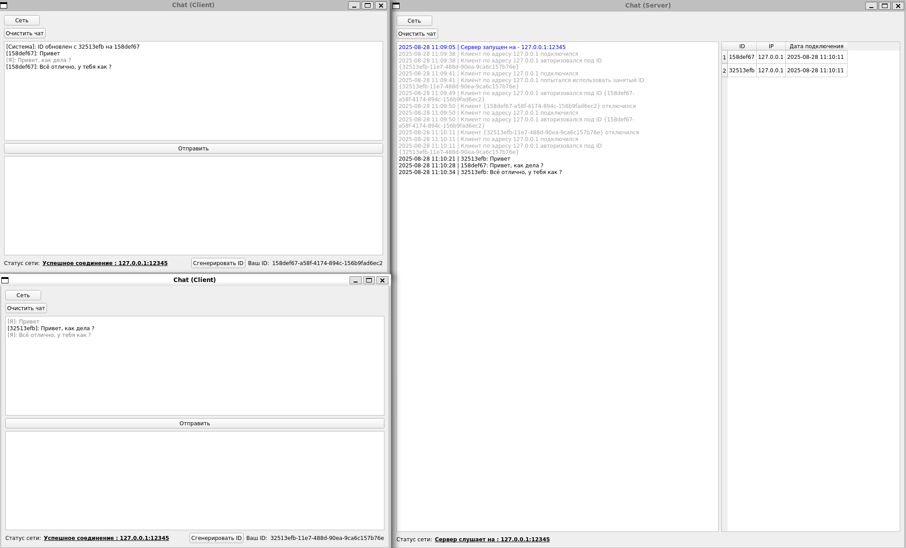

# Клиент-серверный чат

Клиент-серверное приложение для обмена текстовыми сообщениями, разработанное на Qt Creator с TCP для сетевого взаимодействия.

## Screenshots



## 🚀 Функциональность

### Серверная часть
- Запуск/остановка сервера
- Поддержка множества подключений
- Авторизация клиентов по UUID
- Рассылка сообщений
- Логирование системных событий

### Клиентская часть
- Подключение к серверу
- Авторизация с идентификатором
- Отправка и получение текстовых сообщений
- Смена идентификатора
- Отображение статуса соединения

## 📦 Установка и запуск

### Требования
- Qt 5.15 или выше
- Компилятор с поддержкой C++11
- CMake или qmake

### Сборка
```bash
# Клонирование репозитория
git clone <repository-url>
cd chat-app

# Сборка через CMake
mkdir build
cd build
cmake ..
make

# Или через qmake
qmake ../chat-app.pro
make
```

### Конфигурация

**Серверный конфиг (server.json):**
```json
{
    "host": "127.0.0.1",
    "port": 12345,
    "maxMessageSize": 65536
}
```

**Клиентский конфиг (client.json):**
```json
{
    "host": "127.0.0.1",
    "port": 12345,
    "myId": "550e8400-e29b-41d4-a716-446655440000"
}
```

### Запуск
1. Запустите серверное приложение
2. Запустите клиентское приложение(а)
3. Настройте параметры подключения через диалог "Сеть"

## 🎮 Использование

### Сервер
- Запустите сервер с указанными параметрами

### Клиент
- Подключитесь к серверу через диалог "Network"
- Отправляйте сообщения через текстовое поле
- Используйте "Сгенерировать ID" для смены ID
